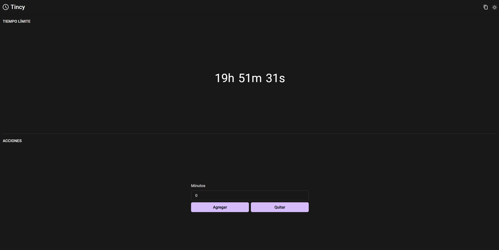

# Tincy
Timer for extendable streams, extends your time based on subscriptions or bits donations

## Instructions
* Update your channel name on `./packages/server/src/constants.ts`
* Run `npm start` on the console while being in this directory
* Add a browser source to OBS for `http://localhost:8001`
* Open `http://localhost:8000` on your browser

## Standalone app
The standalone app is not yet distributed, but if you want to build it, go inside the `electron` folder and run `npm run package`, it will generate an `out` directory with the `.exe` inside.

---
Follow me on [Twitter](https://twitter.gonzalopozzo.com), on [Twitch](https://twitch.gonzalopozzo.com) and doname un [Cafecito](https://cafecito.gonzalopozzo.com) ✨